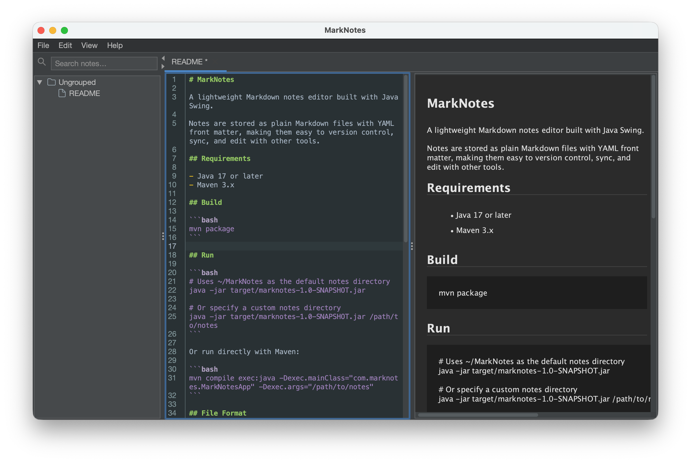

# MarkNotes

A lightweight Markdown notes editor built with Java Swing.

Notes are stored as plain Markdown files with YAML front matter, making them easy to version control, sync, and edit with other tools.



## Requirements

- Java 17 or later
- Maven 3.x

## Build

```bash
mvn package
```

## Run

```bash
# Uses ~/MarkNotes as the default notes directory
java -jar target/marknotes-1.0-SNAPSHOT.jar

# Or specify a custom notes directory
java -jar target/marknotes-1.0-SNAPSHOT.jar /path/to/notes
```

Or run directly with Maven:

```bash
mvn compile exec:java -Dexec.mainClass="com.marknotes.MarkNotesApp" -Dexec.args="/path/to/notes"
```

## File Format

Each note is a Markdown file with a YAML front matter header:

```markdown
---
title: My Note Title
---

Note content goes here...
```

Notes are organized in the filesystem by folder:

```
notes/
  ungrouped-note.md
  work/
    project-ideas.md
    meeting-notes.md
  personal/
    todo.md
```

Application state is saved to `.marknotes` in the notes directory and restored on launch.

## Dependencies

- [RSyntaxTextArea](https://github.com/bobbylight/RSyntaxTextArea) - Syntax highlighting
- [commonmark-java](https://github.com/commonmark/commonmark-java) - Markdown to HTML rendering (with GFM tables, strikethrough, task lists)
- [FlatLaf](https://github.com/JFormDesigner/FlatLaf) - Modern Look and Feel themes
- [PlantUML](https://github.com/plantuml/plantuml) - UML diagram rendering
